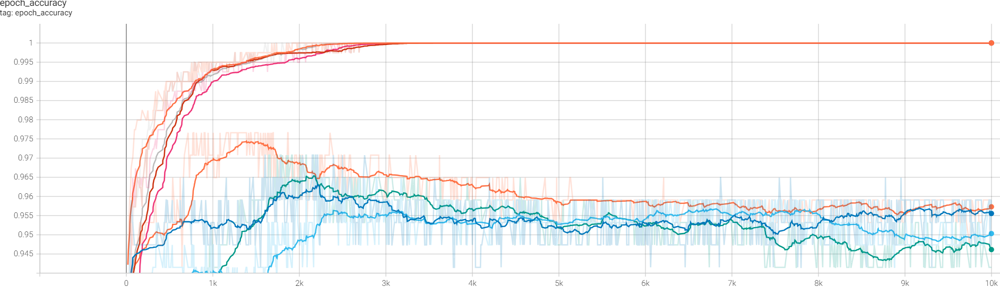
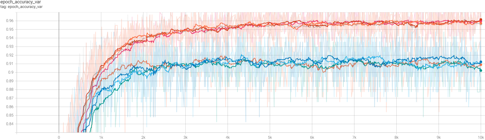
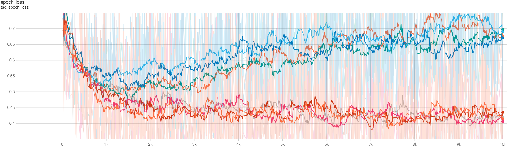
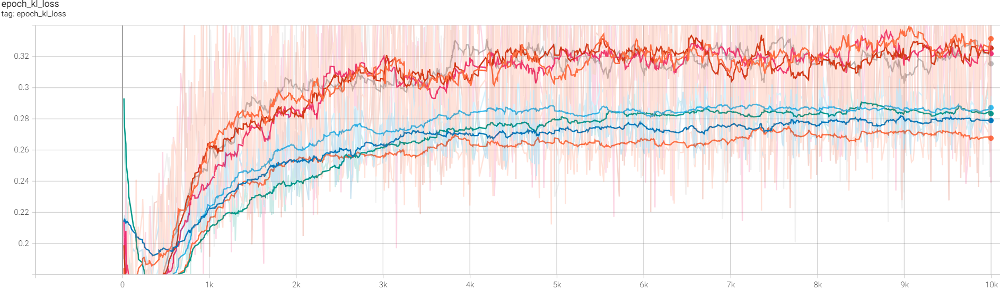
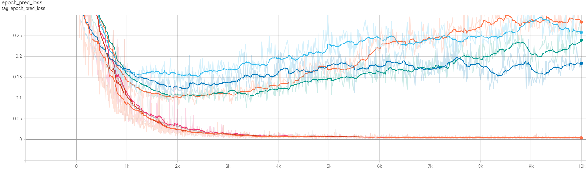

# Házi feladat a Turbine részére - 1st part

Az eredeti koncepcióm az volt, hogy
1. betanítok egy Variational AutoEncodert (VAE),
2. majd ennek Encoder részére ráteszek egy classifier head-et és azt úgy tanítom be, hogy az Encoder esetében trainable=False beállítással fagyasztom a taníthatóságot.

Ezt először a MNIST adatokon (kézzel írt számjegyek) próbáltam ki. Mivel a számjegyek esetében minden pixel (ezek képezik az input csatornákat) releváns információt hordoz, és a számjegyek nagyon jól tipozálhatóak, ezért nagyon jól rekonstruálhatónak bizonyultak, és a koncepcióm jól működött. Mielőtt tovább mennénk, tisztázzuk a variational autoencoderek működését, jellemzőit.

## Variational AutoEncoderek 

A VAE-k eredetileg generatív eszköznek lettek kitalálva főleg képek generálásához, a GAN-ok mellett a legnépszerűbbek voltak erre a célra egy időben. VAE úgy jön létre, hogy egybeépítünk egy olyan Encoder + Decoder párost, 
1. amelynek összeillesztésénél - a továbbiakban: a **neck**ben - , a reprezentáció nagyon kis dimenziószámra (latent_dim) van szorítva a bemeneti csatornaszámhoz képest, illetve
2. a neckben az Encoder kimenete nem fix érték, hanem valamilyen eloszlás, jelen esetben Gauss-eloszlás, amit a tanítás során egyszerű Monte-Carlo módszerrel mintavételezünk, és
3. a lossban a rekonstrukciós loss mellett megjelenik a KL divergencia, ahol a KL divergencia referencia eloszlása a normál-eloszlás N($\mu=0$, $\sigma=1$).

Egy [kifejezetten jó leírás található itt](https://towardsdatascience.com/understanding-variational-autoencoders-vaes-f70510919f73) a VAE-kről, amely megmutatja a koncepcó mögött meghúzódó Bayesiánus gondolatot is.

A VAE-k azt célozzák, hogy a tanítóadatot tipizálják, és ezt a neck-ben úgy reprezentálják, hogy a reprezentáció **teljes** és **folytonos** legyen. 
- A **teljesség** alatt azt értjük, hogy _a tanítóadat mindegyikét_ (kevésbé ideális esetben, "magányos atipikus" train adatok jelenléte mellett: _a tanítóadat zömét_) reprezentálja a latent_dim-beli reprezentáció valmely területe.
- A **folytonosság** pedig azt jelenti, hogy a latent_dim-beli reprezentáció minden lehetséges pontja - egy központi területen - "értelmes" kimenő adatot reprezentál, az adott pontot a Decoder-re beadva éretlmezhető rekonstrukciót kapunk - pl számjegyet, ha számjegyekkel tanítottunk, vagy emberi arcokat, ha emberi arcokkal tanítottunk, ráadásul olyat, ami a tanítóadatban pontosan ebben az alakban nincs jelen, de mégsem "lóg ki" atipikusan a tanítóadat összességéből. Ezt a reconstrukciós loss (pl L2(input-output)) és a KL divergencia együttes használatával érjük el.

## Variational réteg beépítése a kódba

Itt most előreugrunk a leglényegesebb részre, egy általánosabb leírás alább található a kódbázisról. A netutils.py-ban van definiálva a Sampling osztály, ez valósítja meg a neckben a latent_dim számú neuronon a reprezentációt és a mintavételezést. A create_encoder függvényben ugyanitt látható, hogy hogyan épül be a Sampling layer az Encoder-be. A Sampling layer minden inputra egy várható értéket (z_mean) és szigmát (z_log_var, egész pontosan ez a variancia logaritmusának kétszerese) ad vissza, majd ezt mintavételezi és így kapjuk a z-t, ami egy latent_dim hosszúságú vektor. A KL divergencia két _p_($\mu_1$, $\sigma_1$) és _q_($\mu_2$, $\sigma_2$) **egydimenziós** Gauss-eloszlás esetén, ahol _q_ a referencia-eloszlás: 

$$ KL(p,q) = log \dfrac{\sigma_2}{\sigma_1} + \dfrac{\sigma_1^2 + (\mu_1 - \mu_2)^2}{2 \sigma_2^2} - \dfrac{1}{2} $$

Amennyiben a referencia eloszlás N(0, 1), akkor

$$ KL(p,N(0, 1)) = -log(\sigma_1) + \dfrac{\sigma_1^2 + \mu_1^2}{2} - \dfrac{1}{2} $$

Ez a loss tag jelenik meg a vaec_trainer.py-ban a calc_loss függvényben a 76-77-ik sorban. Ez a loss tag arra veszi rá a hálónkat, hogy a neck-ben az egymáshoz típusosan hasonlító bemeneteket egymáshoz közeli eloszlásokkal reprezentálja és ezeket minél jobban a normál eloszlás felé próbálja tolni. Ugyanakkor a rekonstrukciós loss tag (vagy, később a prediction loss) megpróbálja a különféle típusokat egymástól eltávolítani, hogy azok megkülönböztethetőek legyenek. Ha jól megnézzük a KL div általunk használt közelítését, akkor azt látjuk, hogy a várható érték és a szigma egymástól szeparáltan szerepel az összefüggésben. Vagyis a KL div használatának két hatása van: húzza befelé a (0, 0,...)-hoz a várható értéket, a szigmát pedig húzza 1-hez és ez a kettő nem függ direkten egymástól. A KL div és a rekonstrukciós loss (vagy prediction loss) együttesen tehát megvalósítja a teljességet és a folytonosságot is az alábbi módon:
1. A legsűrűbben előforduló train típusokat a neck beli reprezentációban középre (vagyis a (0, 0,...) környékére) húzza, a ritkább esetek a szélekre csúsznak és
2. a típusokat úgy rendezi el egymás mellett, hogy adott két szomszédos típus között a két típus átmenetét kódolja. Ennek megfelelően azokat a típusokat hajlamos egymás mellé rendezni, amelyeknek köztesei gyakrabban fordulnak elő a tanítóadatban, pl 7-esre hasonlító 1-es, vagy 8-asra hasonlító 3-as.
3. Nagyon fontos, ezért külön pontban emelem ki, hogy a tanítás során a latent_dim dimenziójú neck-ben a mintavételezésekkel sűrűn megszórt terület úgy tekinthető, mint egy értelmezési tartomány. Amit itt reprezentálunk, arra a Decoder egyrészt tanítva van, másrészt "értelmes" kimenetet produkál (lásd fentebb: folytonosság).

## Az első megoldás összefoglalása

A kódbázisban látható megoldásomnál arra törekedtem, hogy könnyű legyen esettanulmányokat elvégezni. A **tbaihw.py** demostrálja az eszköz használatát, ennek VS Code-ban Jupyter Notebook cellák indításával történő futtatásával generáltuk a test0x.ipynb notebookokat. A kódbázis klónozása és a requirements.txt alapján a megfelelő környezet kialakítása után futtatható.

Amint azt az osztályok, függvények kommentjeiben részletezem, a VAEC (Variational AutoEncoder and Classifier) osztályból készített példány becsomagolja a tanító és teszt adatokat, és a legfontosabb adatokat (pl config), illetve létrehozza és tartja az encoder, decoder és classifier_head komponenseket. Ezek különféle stratégiával történő betanítása a fit_all_parts(), fit_autoencoder(), fit_classifier_head() és fit_mlp_classifier() tagfüggvényekkel lehetséges:
- fit_all_parts(): Az összes komponenset egyszerre tanítjuk.
- fit_autoencoder(): Csak az encoder-t és decoder-t tanítjuk VAE tanítással.
- fit_classifier_head(): Csak a classifier_head-et tanítjuk.
- fit_mlp_classifier(): Egybe tanítjuk az encodert és a classifier_head-et. Ekkor a kapott modell tisztán MLP classifiernek tekinthető.

A betanítást követően a compile-olás nélkül létrehozott self.mlp_classifier és self.mlp_classifier_with_z használhatóak mint tisztán mlp classifier, illetve olyan classifier, amelynél az autoencoder neck layere is az outputra van kötve (a kódban z).

A tanításokat a VAEC példányon belül készített VAEC_Trainer példányok végzik. Fontos észrevenni, hogy ezek ugyanazokat a decoder, encoder és classifier_head komponenseket tartják, mint a VAEC_Trainereket tartó VAEC példány. Ezek feladata tehát az, hogy a tanítás során szabályozzák, hogy a total_loss-nak mely lossok legyenek a részei, továbbá mely komponensek legyenek taníthatóak, illetve nem taníthatóak.

Ezzel a megoldással úgy terveztem már a Wisconsin Breast Cancer Dataset-en tanítani, hogy a VAEC példány fit_autoencoder tagfüggvényével először betanítom az Encoder-t és a Decoder-t, majd a fit_classifier_head tagfüggvénnyel betanítom a classifier head-et, miközben az Encoder tanítása fagyasztva van. A tapasztalatom az volt, hogy a rekonstrukció nem működött jól. Ennek lehetséges okaként jelöltem meg, hogy a 30 input csatorna nagy része irreleváns információt hordoz.

A Wisconsin Breast Cancer Dataset leírásában tulajdonképpen konkrétan szerepel, hogy a bemenő csatornák nagy része irreleváns: "best predictive accuracy obtained using one separating plane in the 3-D space of Worst Area, Worst Smoothness and Mean Texture. Estimated accuracy 97.5% using repeated 10-fold crossvalidations." Mivel a rekonstrukciós loss úgymond csapkodott, hiszen a VAE tanítás során "lehetetlen feladatot" akarunk megoldani, a rekonstrukciós loss a tanítás során csak "rázza" a tanítandó **wi**, **bi** értékeket, nehéz volt a tanítást értékelni és az Encoder + Classifier head összeállítás accuracy-ja sem járt közel az említett 97.5%-hoz, amit egy MLP classifierrel könnyedén össze lehet hozni (teszt adaton, természetesen). Emiatt a megoldásomat érdekesnek, de sikertelennek értékeltem.

## Aktuális megoldás összefoglalása

Az első megoldásra célzottan létrehozott, fent bemutatott kódomon némi átalakítás eszközlésével egy másik megoldást dolgoztam ki (a kód historikus fejlődése miatt így kicsit feleslegesen elbonyolódott):
1. Itt megjelent a fit_var_mlp_classifier tagfüggvény a VAEC osztályban, ami egybe tanítja a Sampling layerrel ellátott Encodert és a classifier_head-et.
2. Ezen felül a VAEC_trainer úgy lett átalakítva, hogy tanítás során a neck-ben, vagyis a latent_dim dimenziójú reprezentációban az Encoder által kiadott eloszlásokat ténylegesen mintavételezzük, így jön létre a **z** vektor, és ezt kapja a classifier_head mint input, viszont inferenciakor a classifier_head a **z_mean**-t, vagyis az eloszlás várható értékét kapja.

Az így kialakított megoldással az alábbiakat tapasztaltam:
- Az általános tapasztalat a tanítási tesztekkel  az volt, hogy latent_dim=2, 3, ... N-re ugyanazt a klasszifikálási performanszot kapjuk (~97% accuracy) a teszt adaton, míg latent_dim=1-nél a tanulás nem indul be.
-  A test0x.ipynb-ok demonstrálnak pár tanítást latent_dim=2-nél. A notebookokban ábrákat készítettem 8, 16, 32, 64, 128, 256, 512, 1000, 2000, ... 10000 epoch után. Az ábrák bal oldalán mindig a train adattal, a jobb oldalon teszt adattal készített plotok vannak. Felül az adott tanítási epochban ténylegesen mintavételzett eloszlások láthatók fixen [-5, 5] tengelymérettel. Középen a z_mean-ok láthatóak fixen [-3, 3] tengelymérettel, alul ugyanez, de "rugalmas" [min, max] tengelyméretekkel. Ezek az ábrák szépen megmutatják, hogy a tanítás során hogyan szeparálódnak a 0 és 1 labelű classok, illetve, hosszú tanítás után a reprezentáció végül 1 dimenzióba "szorul", és a tanítási adat reprezentációja a két osztályra markánsan elkülönül, lásd a legutolsó ábrákat a notebookokban. (Az egy dimenzióba szorulás oka, hogy a KL divergenciát nem sokdimenziósan (jelen esetben 2 dimenzióban) számoltuk, hanem latent_dim dimenziónkként egydimenziós Gauss eloszlásokként, amelyeket aztán összeadtunk.)
-  Az accuracy paramétert véve alapul, a legjobb klasszifikálási performanszot 1000-2000 epoch környékén értem el, utána ez a megoldás is túltanulási tüneteket mutatott. Ekkorra még a fent kifejtett 1 dimenzióba történő redukálódás nem teljesen játszódik le, lásd az 512, 1000 és 2000 epoch utáni ábrákat, illetve a tanító adat totális szeparációja sem jön létre.

A fent írtakat alátámasztják, illetve kiegészítik az alább közölt tanulási görbék ábrái.

1. ábra: Train és teszt accuracy, **ki**kapcsolt mintavételezéssel inferálva

2. ábra: Train és teszt accuracy, **be**kapcsolt mintavételezéssel inferálva

3. ábra: Train és teszt total loss

4. ábra: Train és teszt KL loss

5. ábra: Train és teszt prediction loss (binary cross entropy)

## Javaslatok értelmezésre

- Én egy teszt adaton vett, kikapcsolt mintavételezéssel számolt accuracy-ra (vagy még inkább F1 score-ra)  optimalizált tanítást választanék, ehhez hasonlót demonstrálnak a Test0x.ipynb notebookokban a 1000, 2000 epoch utáni ábrák.
- A train adatoknál a latent_dim reprezentációba beszórt **z értékek**re (mintavételezés **be**kapcsolva, Test0x.ipynb notebookok ábráin a felső plotok) ráfittelénék egy Gauss-eloszlást, adott esetben skalár szigmával (konstansszor egységmátrix, pontosabban). Egy ismeretlen input esetén megvizsgálnám, hogy azt Encode-olva a z_mean érték belül van-e 1, 2, N szigmán. Ezzel minősíteném, hogy mennyire van az ismeretlen input neck-beli reprezentációja a classifier_head **éretelmezési tartomány**ában.
- A train adatokkal a latent_dim reprezentációba beszórt **z_mean értékek**re (mintavételezés **ki**kapcsolva, Test0x.ipynb notebookok ábráin a középső plotok) is ráfittelnék egy Gauss-eloszlást, de ekkor már a szigmát csak annyira kötném meg, hogy legyen diagonális mátrix. Mindegyik (tehát mindkét) latent_dim-beli dimenzióban megvizsgálnám T-teszttel, hogy egy ismeretlen input z_mean reprezentációja milyen konfidenciával tekinthető az adott Gauss-eloszlásból történő mintavételezésnek? Ez alapján mondanék **konfidenciát**.

## További vizsgálatok

Érdemes lehet visszatérni arra a gondolatra, hogy mégiscsak használjuk az autoencoder + classifier_head tanítást. Itt lehetséges kidolgozni egy eljárást, amivel 
1. ki tudjuk szűrni az irreleváns input csatornákat,
2. ugyanakkor az autoencoder rekonstrukció belevétele a tanításba a latent_dim-beli reprezentációt gazdagabban tipizálná.

Az irreleváns paramétereket tehát oly módon állapíthatjuk meg, hogy megvizsgáljuk, hogy egy VAE + classifier tanítás (erre szolgál a VAEC fit_all_parts tagfüggvénye) során mely csatornákon nem bizonyul lehetségesnek a rekonstrukció. Mivel a VAE + classifier tanítás nem konvergál a Wisconsin Breast Cancer Database adataira az összes 30 input csatorna használata mellett, itt lehet, hogy egy többlépcsős algoritmust kell alkalmazni: 
1. Az első tanítási próbálkozás, vagy több próbálkozás eredményeképpen meg kell állapítani, hogy mely input csatornák a legkevésbé rekonstruálhatóak.
2. Ezeket ki kell venni az input/output csatornák közül, majd ezt követően ismét tanítani kell azzal a céllal, hogy a megmaradt csatornák közül kiválasszuk a legkevésbé rekonstruálhatóakat.
3. Ezt a külső iterációt addig kell folytatni, amíg a meghagyott input csatornák mindegyike jól rekonstruálható lesz.

A megmaradt csatornákat tekinthetjük releváns információ hordozójának. Az íly módon betanított Encoder pedig "érdekesebb" információt tárol, mert a kalsszifikáció két kimenetelén túli típusokra is tipizál a neckben.
